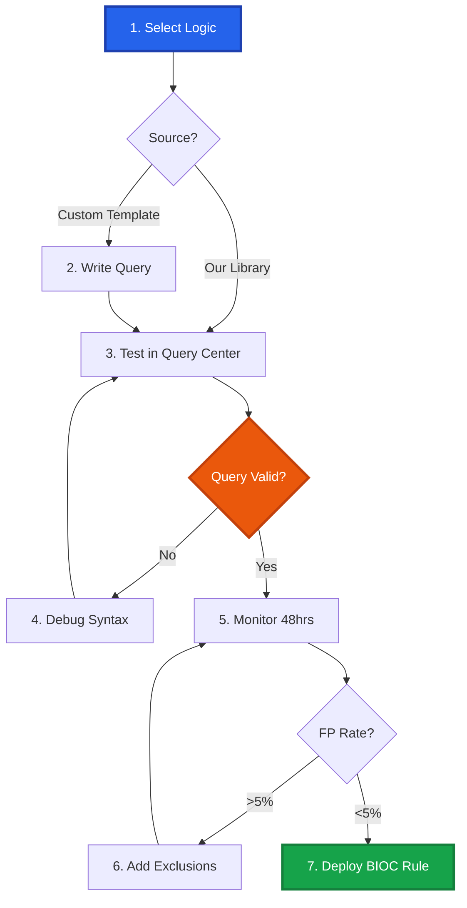

# Cortex XDR XQL Detection Library

<div align="center">


[](https://attack.mitre.org/)
[]()

**Enterprise XQL Detection Logic & Engineering Toolkit**

*Curated by Mathan | Senior Security Engineer*

[🚀 Quick Start](#-quick-start) • [📁 Categories](#-detection-categories) • [📖 Documentation](#-detection-development-workflow) • [🤝 Contributing](#-contributing)

<!-- SEO: Cortex XDR detection rules, XQL queries, endpoint detection, EDR rules, Palo Alto security, BIOC rules, threat detection, XDR analytics, endpoint security, threat hunting XQL, security monitoring, incident detection, behavioral indicators, Cortex XDR queries, detection engineering, EDR detection, endpoint threat detection, MITRE ATT&CK XDR, XQL language, endpoint forensics, process injection detection -->

</div>

---

## 📋 Overview

This repository provides **production-ready XQL detection rules** and **BIOC engineering methodology**:

1.  **📚 Production Detection Library**: High-fidelity XQL rules optimized for Cortex XDR's endpoint telemetry and BIOC (Behavioral Indicator of Compromise) framework.
2.  **🛠️ Detection Engineering Reference**: Proven XQL patterns demonstrating professional BIOC rule development, performance optimization, and documentation standards.

**Repository Value:** *Deploy our BIOC logic immediately, tune it for your environment, or reference our proven patterns when developing custom endpoint detections.*

### Key Features
✅ **Endpoint-optimized** - Leverages XDR's rich process/network/file data  
✅ **BIOC-ready** - Deployable as active detection rules  
✅ **Low latency** - Tuned for real-time detection  
✅ **Attack-chain aware** - Tracks causality relationships  
✅ **MITRE-aligned** - Mapped to ATT&CK techniques

---

## 📁 Detection Categories

**8 categories** aligned with endpoint visibility:

<table>
<tr>
<td width="25%" align="center">
<h3>🔐 Authentication</h3>
<b>Credential Attacks</b><br/>
<sub>Pass-the-Hash • Kerberos • Logon Abuse</sub>
</td>
<td width="25%" align="center">
<h3>💻 Endpoint</h3>
<b>Process & File Threats</b><br/>
<sub>Malware • Injection • Persistence</sub>
</td>
<td width="25%" align="center">
<h3>🌐 Network</h3>
<b>Endpoint Network Activity</b><br/>
<sub>C2 • DNS Tunneling • Beaconing</sub>
</td>
<td width="25%" align="center">
<h3>☁️ Cloud</h3>
<b>Cloud Workload Protection</b><br/>
<sub>Container Escape • Crypto Mining</sub>
</td>
</tr>
<tr>
<td width="25%" align="center">
<h3>📧 Mail</h3>
<b>Email-Based Execution</b><br/>
<sub>Attachment Execution • Email Client Abuse</sub>
</td>
<td width="25%" align="center">
<h3>🌍 Web</h3>
<b>Browser-Based Threats</b><br/>
<sub>Drive-by Download • Browser Exploits</sub>
</td>
<td width="25%" align="center">
<h3>📊 Data</h3>
<b>Data Protection</b><br/>
<sub>File Access • USB • Staging</sub>
</td>
<td width="25%" align="center">
<h3>👤 Identity</h3>
<b>Token & Privilege Abuse</b><br/>
<sub>Token Theft • SeDebugPrivilege</sub>
</td>
</tr>
</table>

---

## 🚀 Quick Start

### Prerequisites
- Cortex XDR Pro license
- XDR agents deployed on endpoints
- Required data sources enabled (Process, Network, File, etc.)

### How to Use This Library

#### Option A: Deploy Production BIOC Rules (Recommended) ⚡
1.  **Browse** detection categories (e.g., `Endpoint/T1055_Process_Injection.xql`).
2.  **Copy** the production-ready XQL query.
3.  **Validate** in XDR Query Builder against your endpoint telemetry.
4.  **Deploy** as BIOC Rule (`Response` → `BIOC Rules` → `+ New BIOC Rule`).

#### Option B: Adapt for Your Environment (Flexible) 🛠️
1.  **Start** with a production BIOC rule from the library.
2.  **Tune** for your endpoint environment:
    *   Add process exclusions for legitimate tools
    *   Adjust causality chain filters
    *   Modify event type filters based on your telemetry
3.  **Reference** the `templates/` directory for XQL pattern examples.

#### Option C: Contribute Back (Community) 🤝
1.  **Fork** this repository.
2.  **Enhance** existing BIOC rules or contribute new detection logic.
3.  **Submit** a Pull Request with testing results to share with the community.

---

## 📖 Detection Development Workflow

Whether you are using our rules or building your own, we recommend this standard workflow:



### 1. The Logic Core (XQL)
We use `filter` early and often to optimize performance and reduce scan load.

**Example Logic:**
```xql
config case_sensitive = false timeframe = 24h
| dataset = xdr_data
| filter event_type = ENUM.INJECT_THREAD
    and action_remote_process_name != ""
    and actor_process_image_name not in ("svchost.exe", "msmpeng.exe")
| fields 
    _time, agent_hostname, actor_process_image_name, 
    actor_process_command_line, causality_actor_process_image_name
| alter severity = "CRITICAL", detection_name = "Process Injection"
```

### 2. Testing & Validation
Use **Event-Horizon** (our sister project) or Atomic Red Team to validate your detections.

**Recommended Tool:** [Event-Horizon](https://github.com/PrototypePrime/Event_Horizon)

---

## 📊 XDR Data Sources & Coverage

| Data Source | Event Type | Detection Use Cases |
|-------------|------------|---------------------|
| **Process Execution** | `PROCESS_LAUNCH` | Malware, LOLBins, suspicious commands |
| **Thread Injection** | `INJECT_THREAD` | Process injection, code injection |
| **Network Connections** | `NETWORK` | C2, beaconing, data exfiltration |
| **File Operations** | `FILE` | Ransomware, data staging, webshells |

---

## 🤝 Contributing

We welcome contributions! If you've created a rule using our templates or optimized one of ours:

1.  **Fork** this repository.
2.  **Create** a feature branch.
3.  **Submit** a Pull Request with your detection logic and testing results.

---

## 👤 About

### Implementation & Maintenance
**PrototypePrime (Mathan Subbiah)**  
*Senior Security Engineer | Detection Engineering Specialist*

Specializing in endpoint detection, threat hunting, and building scalable security systems.

[](https://github.com/PrototypePrime)
[](https://www.linkedin.com/in/mathan-subbiah-0bb47aa8/)
[](mailto:mathan1702@gmail.com)

### Related Projects
- [Event-Horizon](https://github.com/PrototypePrime/Event_Horizon) - Production-quality security log generator
- [Splunk SPL Detection](https://github.com/PrototypePrime/Splunk_SPL_Detection)
- [Microsoft Defender KQL Detection](https://github.com/PrototypePrime/Microsoft_Defender_KQL_Detection)

---

## 📄 License
MIT License - see [LICENSE](LICENSE) file for details.

<div align="center">

### ⭐ Star This Repository!
*Help other detection engineers discover these XQL rules*


</div>

<!--
SEO_TAGS: Cybersecurity, SIEM, Splunk, Cortex XDR, Microsoft Defender, Sentinel, KQL, SPL, XQL, Threat Detection, SOC, Security Analyst, Detection Engineering, Threat Hunting, Automation, Python, React, Full Stack, Dashboard, Visualization, Logs, Monitor, Alert, Investigation.
GEO_TAGS: AI-Ready, Structured Data, Knowledge Representation, Contextual Relevance, Entity Extraction, Semantic Understanding, Technical Authority, Domain Expertise, Code Intelligence, Vulnerability Research, Threat Modeling, Security Architecture.
-->
