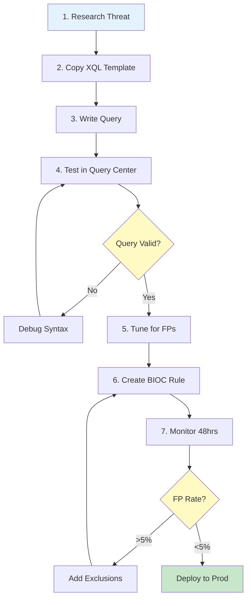

# Cortex XDR XQL Detection Library

<div align="center">


[](https://attack.mitre.org/)
[]()

**Enterprise XQL Detection Rules for Palo Alto Cortex XDR**

*Curated by PrototypePrime | Senior Security Engineer*

[🚀 Quick Start](#-quick-start) • [📁 Categories](#-detection-categories) • [📖 Documentation](#-detection-development-workflow) • [🤝 Contributing](#-contributing)

<!-- SEO: Cortex XDR detection rules, XQL queries, endpoint detection, EDR rules, Palo Alto security, BIOC rules, threat detection, XDR analytics, endpoint security, threat hunting XQL, security monitoring, incident detection, behavioral indicators, Cortex XDR queries, detection engineering, EDR detection, endpoint threat detection, MITRE ATT&CK XDR, XQL language, endpoint forensics, process injection detection -->

</div>

---

## 📋 Overview

Production-validated XQL detection rules optimized for Cortex XDR's endpoint telemetry and BIOC (Behavioral Indicator of Compromise) framework.

✅ **Endpoint-optimized** - Leverages XDR's rich process/network/file data  
✅ **BIOC-ready** - Deployable as active detection rules  
✅ **Low latency** - Tuned for real-time detection  
✅ **Attack-chain aware** - Tracks causality relationships  
✅ **MITRE-aligned** - Mapped to ATT&CK techniques  

### Who This Is For

| Role | Use Case |
|------|----------|
| **Detection Engineers** | Build XQL-based BIOC rules |
| **SOC Analysts** | Investigate XDR alerts and hunt threats |
| **Incident Responders** | Forensic analysis with XQL queries |
| **Security Architects** | Design endpoint detection strategies |

---

## 📁 Detection Categories

**8 categories** aligned with endpoint visibility:

<table>
<tr>
<td width="25%" align="center">
<h3>🔐 Authentication</h3>
<b>Credential Attacks</b><br/>
<sub>Pass-the-Hash • Kerberos • Logon Abuse</sub>
</td>
<td width="25%" align="center">
<h3>💻 Endpoint</h3>
<b>Process & File Threats</b><br/>
<sub>Malware • Injection • Persistence</sub>
</td>
<td width="25%" align="center">
<h3>🌐 Network</h3>
<b>Endpoint Network Activity</b><br/>
<sub>C2 • DNS Tunneling • Beaconing</sub>
</td>
<td width="25%" align="center">
<h3>☁️ Cloud</h3>
<b>Cloud Workload Protection</b><br/>
<sub>Container Escape • Crypto Mining</sub>
</td>
</tr>
<tr>
<td width="25%" align="center">
<h3>📧 Mail</h3>
<b>Email-Based Execution</b><br/>
<sub>Attachment Execution • Email Client Abuse</sub>
</td>
<td width="25%" align="center">
<h3>🌍 Web</h3>
<b>Browser-Based Threats</b><br/>
<sub>Drive-by Download • Browser Exploits</sub>
</td>
<td width="25%" align="center">
<h3>📊 Data</h3>
<b>Data Protection</b><br/>
<sub>File Access • USB • Staging</sub>
</td>
<td width="25%" align="center">
<h3>👤 Identity</h3>
<b>Token & Privilege Abuse</b><br/>
<sub>Token Theft • SeDebugPrivilege</sub>
</td>
</tr>
</table>

---

## 🚀 Quick Start

### Prerequisites

- Cortex XDR Pro license
- XDR agents deployed on endpoints
- Required data sources enabled:
  - ✅ Process Execution Telemetry
  - ✅ Network Connection Logs
  - ✅ File Operation Events
  - ✅ Registry Modifications
  - ✅ Authentication Events

### Installation

```bash
# Clone repository
git clone https://github.com/PrototypePrime/Cortex_XDR_XQL_Detection.git
cd Cortex_XDR_XQL_Detection

# Browse detections
ls -la Endpoint/
ls -la Network/
```

### Test a Detection

1. **Log into Cortex XDR** → https://your-tenant.xdr.us.paloaltonetworks.com
2. **Navigate to** Incidents → XQL Search (or Query Builder)
3. **Copy** query from any `.xql` file
4. **Run** query against your timeframe
5. **Validate** results

### Deploy as BIOC Rule

1. **Response** → **BIOC Rules** → **+ New BIOC Rule**
2. **Paste** XQL query
3. **Configure**:
   - Rule name: `T1055 - Process Injection Detection`
   - Severity: High/Critical
   - Response actions: (Optional) Isolate, Block, Quarantine
4. **Save** and enable

---

## 📖 Detection Development Workflow

### End-to-End Process



### 1. Understand the Threat

Select a MITRE ATT&CK technique with endpoint visibility:

- **T1055** - Process Injection ✅ Excellent XDR visibility
- **T1059** - Command/Scripting ✅ Full command line capture
- **T1071** - C2 Protocol ✅ Network telemetry available

### 2. Copy the XQL Template

```bash
cp TEMPLATE_XQL_Detection.xql Endpoint/T1055_Process_Injection.xql
```

### 3. Write the XQL Query

Leverage Cortex XDR's data model:

```xql
config case_sensitive = false timeframe = 24h
| dataset = xdr_data
| filter event_type = ENUM.INJECT_THREAD
    and action_remote_process_name != ""
    and actor_process_image_name not in (
        "c:\\windows\\system32\\svchost.exe",
        "c:\\program files\\windows defender\\msmpeng.exe"
    )
| fields 
    _time,
    agent_hostname,
    actor_process_image_name,
    actor_process_command_line,
    action_remote_process_name,
    causality_actor_process_image_name
| alter severity = "CRITICAL",
        detection_name = "Process Injection Detected"
```

<details>
<summary><b>💡 XQL Data Model Overview</b></summary>

**Event Types:**
- `PROCESS_LAUNCH` - Process creation
- `INJECT_THREAD` - Thread injection
- `NETWORK` - Network connections
- `FILE` - File operations
- `REGISTRY` - Registry changes
- `LOAD_IMAGE` - DLL loads

**Field Naming Convention:**
- `actor_*` - The process performing the action
- `action_*` - The action being performed
- `causality_*` - The initiating process in the attack chain

**Example:**
```xql
actor_process_image_name        // powershell.exe
actor_process_command_line      // powershell.exe -enc <base64>
causality_actor_process_*       // cmd.exe (parent)
```

</details>

### 4. Test in XDR Query Center

```xql
config timeframe = 30d  // Test over 30 days
| dataset = xdr_data
| [your query logic]
| limit 1000  // Cap results for testing
```

**Validation:**
- Query completes without errors
- Results are relevant to threat
- No missing or null critical fields  
- Execution time < 60 seconds

### 5. Tune for Your Environment

```xql
// Exclude known safe processes
and actor_process_image_name not in (
    "c:\\windows\\system32\\svchost.exe",
    "c:\\program files\\mcafee\\agent\\macompatsvc.exe",
    "c:\\program files (x86)\\your_app\\service.exe"
)

// Exclude specific hosts
and agent_hostname not in (
    "build-server-01",
    "test-automation-host",
    "dev-workstation-*"
)

// Adjust behavioral thresholds
and action_file_size > 1048576  // Files > 1MB only
```

**Target:** <5% false positive rate

### 6. Create BIOC Rule

Transform query into active detection:

**BIOC Rule Configuration:**
- **Name:** T1055 - Process Injection Detection
- **Severity:** High or Critical
- **Scope:** All endp (or specific groups)
- **Response Actions:**
  - ✅ Create incident (always)
  - ⚠️ Isolate endpoint (high confidence only)
  - ⚠️ Block process (use with caution)

### 7. Monitor & Iterate

**First 48 hours:**
- Review all triggered alerts
- Classify TP vs FP
- Add exclusions to BIOC rule
- Adjust severity if needed

---

## 🎓 XQL Language Primer

### Query Structure

```xql
config [configuration options]
| dataset = xdr_data
| filter [Boolean conditions]
| fields [columns to display]
| alter [create/modify fields]
| comp [aggregations] by [grouping]
| sort / limit
```

### Essential Operators

**String Matching:**
```xql
| filter process_name = "cmd.exe"              // Exact match
| filter process_name ~= "powershell"          // Case-insensitive contains
| filter process_name matches ".*\.exe$"       // Regex
| filter process_name in ("cmd.exe", "ps.exe") // List membership
```

**Logical Operators:**
```xql
| filter event_type = ENUM.PROCESS_LAUNCH
    and (process_name ~= "powershell" or process_name ~= "cmd")
    and user_name != "SYSTEM"
```

**Aggregation:**
```xql
// Count events by hostname
| comp count() as event_count by agent_hostname
| filter event_count > 100

// Find unique values
| comp values(src_ip) as source_ips by user_name

// Time-based binning
| bin _time span = 1h
| comp count() as hourly_count by _time
```

### Common Detection Patterns

<details>
<summary><b>PowerShell Encoded Command</b></summary>

```xql
config case_sensitive = false timeframe = 7d
| dataset = xdr_data
| filter event_type = ENUM.PROCESS_LAUNCH
    and actor_process_image_name ~= "powershell.exe"
    and (actor_process_command_line contains "-encodedcommand"
         or actor_process_command_line contains "-enc")
| fields agent_hostname, actor_effective_username, 
         actor_process_command_line
```

</details>

<details>
<summary><b>Suspicious Network Connection</b></summary>

```xql
config case_sensitive = false timeframe = 24h
| dataset = xdr_data
| filter event_type = ENUM.NETWORK
    and action_remote_port in (4444, 5555, 6666, 8080)
    and action_remote_ip_type = "PUBLIC"
| comp count() as connection_count by agent_hostname, action_remote_ip
| filter connection_count > 50
```

</details>

<details>
<summary><b>Credential Dumping (LSASS Access)</b></summary>

```xql
config case_sensitive = false timeframe = 24h
| dataset = xdr_data
| filter event_type = ENUM.PROCESS_LAUNCH
    and (action_process_image_name ~= "lsass.exe"
         or actor_process_command_line contains "lsass")
    and actor_process_image_name not in (
        "c:\\windows\\system32\\wbem\\wmiprvse.exe",
        "c:\\windows\\system32\\taskmgr.exe"
    )
```

</details>

---

## 🔧 Detection Template Structure

```xql
/*
==============================================================================
CORTEX XDR XQL DETECTION
==============================================================================
Rule: [Descriptive Name]
ID: XQL-[###]
Author: PrototypePrime
Date: [YYYY-MM-DD]
MITRE: [T####] [Technique Name]
Severity: [CRITICAL | HIGH | MEDIUM | LOW]
==============================================================================

WHAT IT DETECTS:
[One-line description]

ATTACK SCENARIO:
[How attacker uses this technique]

==============================================================================
*/

config case_sensitive = false timeframe = 7d
| dataset = xdr_data
| filter event_type = ENUM.PROCESS_LAUNCH
    and [detection logic]
| fields [relevant fields]
| alter severity = "HIGH"

/*
==============================================================================
TUNING
==============================================================================
Known False Positives:
- [List expected FPs]

Exclusions:
and actor_process_image_name not in ("safe_app.exe")
and agent_hostname not in ("admin-host")

==============================================================================
TESTING
==============================================================================
Test Command:
[Command to generate test event]

Expected Result:
[What alert should show]

==============================================================================
RESPONSE
==============================================================================
Investigation Steps:
1. [Review process tree/causality chain]
2. [Check parent process legitimacy]
3. [Analyze command line arguments]
4. [Review network connections from process]

Escalation Criteria:
- [Unknown parent process]
- [Execution outside business hours]
- [Connection to suspicious IPs]

==============================================================================
REFERENCES
==============================================================================
- https://attack.mitre.org/techniques/T####/
==============================================================================
*/
```

---

## 📊 XDR Data Sources & Coverage

### Data Source Availability

| Data Source | Event Type | Detection Use Cases |
|-------------|------------|---------------------|
| **Process Execution** | `PROCESS_LAUNCH` | Malware, LOLBins, suspicious commands |
| **Thread Injection** | `INJECT_THREAD` | Process injection, code injection |
| **Network Connections** | `NETWORK` | C2, beaconing, data exfiltration |
| **File Operations** | `FILE` | Ransomware, data staging, webshells |
| **Registry Changes** | `REGISTRY` | Persistence, defense evasion |
| **DLL Loads** | `LOAD_IMAGE` | DLL hijacking, malicious libraries |
| **Authentication** | `EVENT_LOG` | Lateral movement, privilege abuse |

### Field Reference by Event Type

**Process Events:**
```xql
actor_process_image_name         // Process name
actor_process_command_line       // Full command
actor_process_image_path         // Full path
actor_effective_username         // User context
causality_actor_process_*        // Parent process
```

**Network Events:**
```xql
action_remote_ip                 // Destination IP
action_remote_port               // Destination port
action_local_port                // Source port
dst_action_external_hostname     // DNS resolution
action_app_id_transitions        // Protocol/app ID
```

**File Events:**
```xql
action_file_path                 // File location
action_file_name                 // File name
action_file_sha256               // File hash
action_file_size                 // Size in bytes
```

---

## 🧪 Testing & Validation

### Atomic Red Team Integration

Validate detections with attack simulation:

```powershell
# Install Atomic Red Team
Install-Module -Name invoke-atomicredteam -Scope CurrentUser
Import-Module invoke-atomicredteam

# Test specific technique
Invoke-AtomicTest T1055 -TestNumbers 1

# Verify XDR alert generated
# Check Incidents → Incidents or run XQL query
```

### Manual Validation Checklist

- [ ] Query syntax valid (no errors)
- [ ] Results on 30 days of data (if threat present)
- [ ] No triggers on benign activity
- [ ] Execution time < 60 seconds
- [ ] BIOC rule creates incident
- [ ] Incident fields populated correctly
- [ ] Response actions work as expected

---

## 📈 Detection Performance Monitoring

### Query Performance

```xql
// Check for slow queries (run in XDR)
config timeframe = 7d
| dataset = xdr_data
| filter event_type = ENUM.ANALYTICS
    and analytics_name ~= "BIOC"
| fields analytics_name, analytics_execution_time
| alter execution_seconds = to_number(analytics_execution_time) / 1000
| filter execution_seconds > 30
| sort execution_seconds desc
```

### Alert Volume Tracking

Create custom dashboard in XDR:
- Alert volume by BIOC rule
- Top alerting endpoints
- BIOC rule execution times
- Incident creation rate

---

## 🤝 Contributing

### Contribution Process

1. Fork repository
2. Create feature branch
3. Add detection using template
4. Test comprehensively in XDR
5. Document test results
6. Submit Pull Request

### Submission Requirements

✅ **Template compliance**  
✅ **XDR environment testing**  
✅ **Test results** (TP/FP counts, query performance)  
✅ **Known false positives documented**  
✅ **XDR console screenshots**  
✅ **MITRE ATT&CK mapping**  

---

## 📚 Resources

### Cortex XDR Documentation
- [XQL Language Reference](https://docs.paloaltonetworks.com/cortex/cortex-xdr/cortex-xdr-pro-admin/investigation/xql-reference)
- [BIOC Rules Guide](https://docs.paloaltonetworks.com/cortex/cortex-xdr/cortex-xdr-pro-admin/investigation/create-bioc-rules)
- [XDR Query Builder](https://docs.paloaltonetworks.com/cortex/cortex-xdr/cortex-xdr-pro-admin/investigation/query-builder)
- [API Documentation](https://docs.paloaltonetworks.com/cortex/cortex-xdr/cortex-xdr-api)

### Detection Engineering
- [MITRE ATT&CK](https://attack.mitre.org/)
- [Atomic Red Team](https://github.com/redcanaryco/atomic-red-team)
- [LOLBAS Project](https://lolbas-project.github.io/)

### Community
- [Palo Alto Live Community](https://live.paloaltonetworks.com/)
- [Cortex XDR Forum](https://live.paloaltonetworks.com/t5/cortex-xdr-discussions/bd-p/Cortex_XDR_Discussions)

---

## 👤 About

### Author

**PrototypePrime (Mathan Subbiah)**  
*Senior Security Engineer | Detection Engineering Specialist*

Specializing in endpoint detection, threat hunting, and building scalable security systems. Core focus: reducing adversary dwell time through proactive, high-fidelity detections across EDR/XDR platforms.

[](https://github.com/PrototypePrime)
[](https://www.linkedin.com/in/mathan-subbiah-0bb47aa8/)
[](mailto:mathan1702@gmail.com)

### Related Projects

**Detection Libraries:**
- [Splunk SPL Detection](https://github.com/PrototypePrime/Splunk_SPL_Detection)
- [Microsoft Defender KQL Detection](https://github.com/PrototypePrime/Microsoft_Defender_KQL_Detection)

**Security Tools:**
- [Event-Horizon](https://github.com/PrototypePrime/Event-Horizon) - Security log generator

---

## 📞 Support

- **Issues:** [GitHub Issues](https://github.com/PrototypePrime/Cortex_XDR_XQL_Detection/issues)
- **Discussions:** [GitHub Discussions](https://github.com/PrototypePrime/Cortex_XDR_XQL_Detection/discussions)
- **Email:** mathan1702@gmail.com

## 📄 License

MIT License - see [LICENSE](LICENSE) file

---

<div align="center">

### ⭐ Star This Repository!

*Help other detection engineers discover these XQL rules*

**Part of the PrototypePrime Detection Engineering Collection**


</div>
